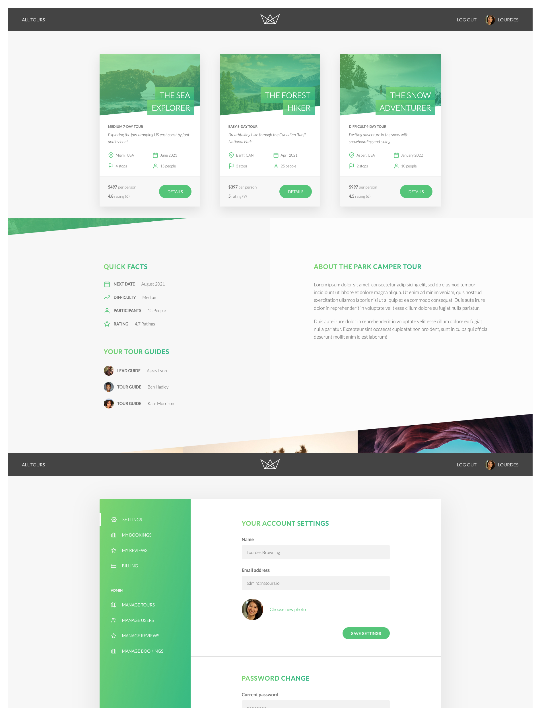

# <span align="center"><samp>Natours</samp></span>

REST API and server-rendered site (Pug) for the fictional tour company Natours. Users browse tours, log in, book tours via Stripe, manage their account and profile photo. Email sending (welcome, password reset), upload of user photos and tour images with processing (Sharp). Admin panel: tours, users, bookings, statistics.

This project is based on [_Node.js, Express, MongoDB & More: The Complete Bootcamp 2024_](https://www.udemy.com/course/nodejs-express-mongodb-bootcamp/) by Jonas Schmedtmann. Educational repository – not intended for production use.

## Demo



## Features

- **Authentication**: signup, login (JWT in cookie), logout, protected routes, roles (user, guide, lead-guide, admin)
- **Passwords**: forgot password / reset password with link sent by email (Pug templates)
- **Users**: profile update (name, email), avatar photo (upload + Sharp resize), change password, soft delete (deleteMe)
- **Tours**: CRUD, filtering, sorting, pagination, aliases (e.g. top-5-cheap), stats, monthly plan, geolocation (tours within distance, distances), image upload (cover + gallery) with Sharp processing
- **Reviews**: nested under `/tours/:tourId/reviews`, CRUD
- **Bookings**: Stripe Checkout session, create booking after payment, booking management (admin/lead-guide)
- **Views (Pug)**: overview, tour detail, login, user account, my tours
- **Email**: welcome on signup, password reset (Nodemailer; SendGrid in production), HTML templates (Pug)
- **Security**: Helmet, rate limiting, NoSQL/XSS sanitization, hpp, CORS, input validation

## Tech stack

- **Node.js** + **Express**
- **MongoDB** + **Mongoose**
- **Pug** – view and email templates
- **JWT** (jsonwebtoken) + **cookie-parser** – session
- **Stripe** – payments (Checkout Session)
- **Nodemailer** – email sending (SendGrid in production)
- **Multer** + **Sharp** – upload and image processing
- **bcryptjs** – password hashing
- **validator**, **slugify** – validation and slugs
- **Parcel** – frontend bundling (e.g. Stripe, login) in `public/js`
- **Postman** – API testing

## Pages

- `/` – tour overview (booking is created after successful payment)
- `/tour/:slug` – tour details
- `/login` – login form
- `/me` – user account (protected)
- `/my-tours` – my tours (protected)

## Project structure

```bash
├── app.js                    # Express app, middlewares, route mounting
├── server.js                 # DB connection, listen, global error handling
├── config.env                # Environment variables (e.g. MONGO_DB, JWT_SECRET, STRIPE_*)
├── controllers/
│   ├── authController.js     # signup, login, logout, protect, restrictTo, forgot/reset password
│   ├── userController.js     # updateMe, upload/resize photo, getMe, deleteMe, user CRUD
│   ├── tourController.js     # tour CRUD, aliases, stats, geospatial, upload/resize images
│   ├── reviewController.js   # review CRUD (nested)
│   ├── bookingController.js  # Stripe Checkout, createBooking, booking CRUD
│   ├── viewController.js     # Pug view rendering (overview, tour, login, account, my-tours)
│   ├── errorController.js    # global error handler
│   └── handleFactory.js      # factory: createOne, getOne, getAll, updateOne, deleteOne
├── models/                   # Mongoose schemas: User, Tour, Review, Booking
├── routes/                   # Express routers (API + view routes)
├── views/                    # Pug: base, overview, tour, login, account, error, emails
│   └── emails/               # welcome, passwordReset, baseEmail
├── utils/
│   ├── email.js              # Email class (Nodemailer, Pug)
│   ├── catchAsync.js
│   ├── appError.js
│   └── apiFeatures.js        # filtering, sorting, pagination
├── public/
│   └── js/                   # frontend (Parcel → bundle.js), Stripe, login, maps
└── dev-data/                 # seed data (tours, users, reviews)
```

## Instalacja

```bash
# 1. Clone
git clone https://github.com/zeglicz/natours-api.git
cd natours-api

# 2. Dependencies
npm install

# 3. Environment variables
# Create config.env and set: MONGO_DB, JWT_SECRET, STRIPE_SECRET_KEY, STRIPE_WEBHOOK_SECRET, EMAIL_*, etc.

# 4. (Optional) Import dev data
node dev-data/data/import-dev-data.js --import

# 5. Run
npm run dev          # nodemon
# or
npm run start:dev    # node server.js
```
